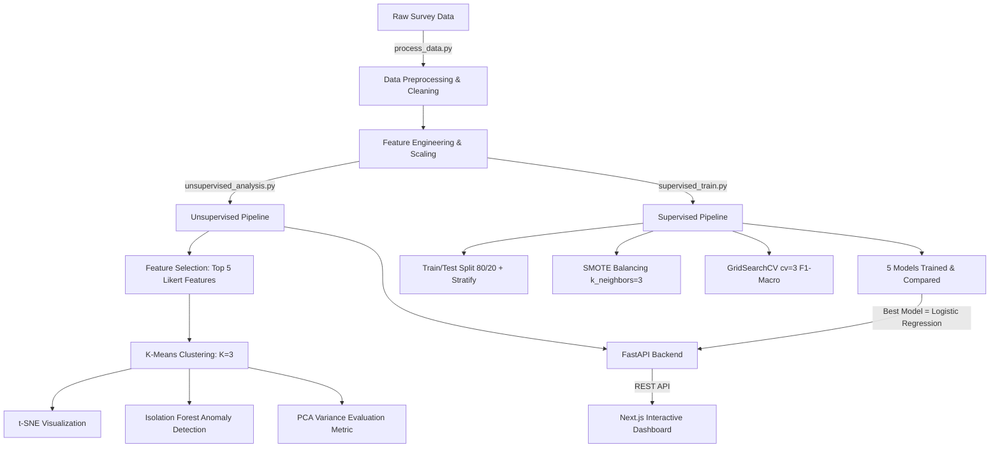

# รายงานผลการวิเคราะห์ข้อมูลและพัฒนาระบบ Machine Learning (Kiyora Brand Analysis)

---

## 1. ปัญหาทางธุรกิจ (Business Problem)

**Kiyora** เป็นแบรนด์ผลิตภัณฑ์ทำความสะอาดผิวหน้า (Cleansing Water) ที่ต้องเผชิญกับการแข่งขันสูงในตลาดสกินแคร์ ปัญหาหลักคือความยากในการทำความเข้าใจ **พฤติกรรมที่ซับซ้อนของผู้บริโภค** และ **ไม่สามารถคาดการณ์แนวโน้มการซื้อซ้ำ** (Customer Retention) ได้อย่างแม่นยำ

**วัตถุประสงค์หลักของการนำ AI/ML มาใช้:**
1. **Customer Segmentation (Unsupervised):** แบ่งกลุ่มลูกค้าเป้าหมายตามพฤติกรรมและทัศนคติ เพื่อออกแบบ Personalized Marketing ที่ตรงจุด
2. **Purchase Prediction (Supervised):** สร้างโมเดลทำนายว่าลูกค้าคนใดมีแนวโน้มเลือกใช้แบรนด์ Kiyora เพื่อลด Churn Rate และเพิ่มยอดขาย

---

## 2. ภาพรวม ML Pipeline / System Architecture

ระบบพัฒนาแบบ End-to-End Pipeline ตั้งแต่การเตรียมข้อมูลไปจนถึงการแสดงผลบน Web Dashboard:



---

## 3. การทำความสะอาดและเตรียมข้อมูล (Data Preprocessing)

ทำผ่านสคริปต์ `src/process_data.py` เพื่อแปลงข้อมูลแบบสอบถามดิบ (Raw Survey) ให้เป็นข้อมูลพร้อมเทรนโมเดล (`data/clean.csv`)

### 3.1 Logic Check & Feature Engineering
- **Logic Check:** ลบข้อมูลที่ขัดแย้งกันเอง (เช่น ตอบว่าไม่มีสิวแต่ระดับสิวรุนแรง)
- **Feature Extraction:**
  - `concern_count` — นับจำนวนปัญหาผิวทั้งหมดที่กังวล
  - `influence_score` — รวมคะแนนอิทธิพลจากแพทย์ เพื่อน และบล็อกเกอร์
  - `is_price_sensitive` — รวมคะแนนความอ่อนไหวต่อราคาและโปรโมชั่น
  - `acne_score` — ระดับความรุนแรงของปัญหาสิว
  - `*_score` (Likert) — คะแนนความต้องการคุณสมบัติผลิตภัณฑ์ 10 ด้าน (Deep Cleansing, Acne Friendly ฯลฯ)

### 3.2 Data Scaling
- **MinMaxScaler:** ใช้กับ Likert Scale ทุกตัว → ปรับค่าให้อยู่ระหว่าง 0–1
- **StandardScaler:** ใช้ใน Unsupervised Pipeline ซ้อนทับ → ปรับ Mean=0, Std=1 เพื่อให้ K-Means คำนวณระยะห่างได้ถูกต้อง

```python
# MinMaxScaler สำหรับ Likert Scale (ใน process_data.py)
scaler = MinMaxScaler()
df[likert_cols] = scaler.fit_transform(df[likert_cols])

# StandardScaler สำหรับ Clustering (ใน unsupervised_analysis.py)
scaler = StandardScaler()
X_scaled = scaler.fit_transform(X_cluster)
```

---

## 4. Unsupervised Learning Pipeline (AIE324 & AIE325)

### 4.1 ทฤษฎีที่ใช้
- **K-Means Clustering:** จัดกลุ่มข้อมูลโดยลด Inertia (ระยะห่างระหว่างจุดกับ Centroid)
- **Elbow Method & Silhouette Score:** ประเมินคุณภาพการแบ่งกลุ่ม เพื่อหาจำนวน K ที่เหมาะสม
- **t-SNE (t-Distributed Stochastic Neighbor Embedding):** ลดมิติข้อมูลเพื่อวาดกราฟ 2D แบบ Non-linear รักษาโครงสร้างความสัมพันธ์ของข้อมูลได้ดีกว่า PCA สำหรับ Visualization
- **PCA (Principal Component Analysis):** ใช้เป็น Evaluation Metric เพื่อวัดว่าข้อมูล 5 มิติสามารถลดเหลือ 2 มิติโดยรักษาข้อมูลได้กี่เปอร์เซ็นต์ (Explained Variance)
- **Isolation Forest:** ตรวจหา Anomaly โดยวัดว่าจุดข้อมูลใดถูกแยกออกได้ง่ายผิดปกติ (ใช้ contamination=0.05)

### 4.2 Descriptive Statistics & Correlation Analysis (ข้อมูลจริง)

ก่อนทำโมเดล วิเคราะห์ข้อมูลในภาพรวมจาก 5 Likert Features ที่คัดเลือกไว้:

**Descriptive Statistics (N=82):**

| Feature | Mean | Std | Min | 25% | Median | 75% | Max |
|---|---|---|---|---|---|---|---|
| deep_cleansing_score | **0.90** | 0.23 | 0.00 | 1.00 | 1.00 | 1.00 | 1.00 |
| acne_friendly_score | 0.83 | 0.25 | 0.00 | 0.75 | 1.00 | 1.00 | 1.00 |
| sensitive_skin_score | 0.85 | 0.29 | 0.00 | 1.00 | 1.00 | 1.00 | 1.00 |
| moisturizing_score | 0.78 | 0.29 | 0.00 | 0.50 | 1.00 | 1.00 | 1.00 |
| oil_control_score | 0.77 | 0.25 | 0.00 | 0.50 | 0.75 | 1.00 | 1.00 |

**ข้อสังเกต:** `deep_cleansing_score` มีค่าเฉลี่ยสูงที่สุด (0.90) สะท้อนว่าความสะอาดเชิงลึกคือ Need อันดับ 1 ของลูกค้า Kiyora ทุกกลุ่ม

**Correlation Matrix (ค่าจริง):**

| | deep_cleansing | acne_friendly | sensitive_skin | moisturizing | oil_control |
|---|---|---|---|---|---|
| **deep_cleansing** | 1.00 | 0.27 | **0.42** | 0.11 | -0.02 |
| **acne_friendly** | 0.27 | 1.00 | 0.29 | 0.09 | **0.39** |
| **sensitive_skin** | 0.42 | 0.29 | 1.00 | 0.05 | 0.15 |
| **moisturizing** | 0.11 | 0.09 | 0.05 | 1.00 | **0.37** |
| **oil_control** | -0.02 | 0.39 | 0.15 | 0.37 | 1.00 |

**Insight จาก Correlation:**
- `deep_cleansing` ↔ `sensitive_skin` = **0.42** (คู่ที่มีความสัมพันธ์สูงที่สุด) → คนผิวแพ้ง่ายมักต้องการทำความสะอาดเชิงลึกพร้อมกัน
- `acne_friendly` ↔ `oil_control` = **0.39** → คนเป็นสิวมักต้องการคุมมันด้วยเสมอ
- `deep_cleansing` ↔ `oil_control` = **-0.02** → แทบไม่สัมพันธ์กัน แสดงว่าทั้งสองเป็น Dimension ที่แยกจากกัน เหมาะสำหรับ Clustering

### 4.3 การปรับปรุงโมเดล: Feature Selection (สำคัญมาก)

**ปัญหาเดิม:** ทดลองใช้ฟีเจอร์ทั้งหมด 14 ตัว (Likert 10 + Behavior 4) พบว่าข้อมูลมี Sparsity สูง (คนตอบเหมือนกันหมดในหลายมิติ) ทำให้ K-Means แยกกลุ่มได้ไม่ดี

**การแก้ไข:** คัดเลือกเฉพาะ **5 ฟีเจอร์ Likert ที่มีความแตกต่างระหว่างกลุ่มสูงที่สุด** มาใช้ในการ Clustering:

| ฟีเจอร์ | ความหมาย |
|---|---|
| `deep_cleansing_score` | คะแนนความต้องการทำความสะอาดเชิงลึก |
| `acne_friendly_score` | คะแนนความต้องการสูตรไม่ก่อสิว |
| `sensitive_skin_score` | คะแนนความต้องการสูตรอ่อนโยนผิวแพ้ง่าย |
| `moisturizing_score` | คะแนนความต้องการเพิ่มความชุ่มชื้น |
| `oil_control_score` | คะแนนความต้องการควบคุมความมัน |

**ผลลัพธ์หลังปรับ (ข้อมูลจริงจากการรัน):**

| ตัวชี้วัด | ค่า | ความหมาย |
|---|---|---|
| **Silhouette Score** | **0.3466** | กลุ่มเกาะตัวกันและแยกจากกันได้ดี (> 0.25 = ใช้ได้) |
| **K-Means Inertia (K=3)** | **231.16** | ระยะห่างภายในกลุ่มต่ำ = กลุ่มหนาแน่น |
| **PCA Explained Variance** | **37.4% + 25.0% = 62.4%** | 2 แกนหลักรักษาข้อมูลต้นฉบับไว้ได้ 62.4% |
| **จำนวนลูกค้า** | **82 คน** | ขนาด Dataset |
| **Anomaly ที่ตรวจพบ** | **5 คน (6.1%)** | พฤติกรรมผิดปกติจาก Isolation Forest |

### 4.3 กระบวนการ Clustering (โค้ดจริง)

```python
# Feature Selection: Top 5 Likert Features
top_5_likert = ["deep_cleansing_score", "acne_friendly_score",
                "sensitive_skin_score", "moisturizing_score", "oil_control_score"]
X_cluster = df[top_5_likert].fillna(0)

# Standardize
scaler = StandardScaler()
X_scaled = scaler.fit_transform(X_cluster)

# Elbow & Silhouette Evaluation (K=2 to 10)
for k in range(2, 11):
    km = KMeans(n_clusters=k, random_state=42, n_init=10)
    km.fit(X_scaled)
    silhouette_scores.append(silhouette_score(X_scaled, km.labels_))

# Final Clustering: K=3 (Business Logic)
kmeans = KMeans(n_clusters=3, random_state=42, n_init=10)
df['cluster'] = kmeans.fit_predict(X_scaled)

# Visualization: t-SNE (แทน PCA เพราะแยกกลุ่มชัดกว่าสำหรับข้อมูล Survey)
tsne = TSNE(n_components=2, random_state=42, perplexity=30)
tsne_results = tsne.fit_transform(X_scaled)

# PCA: ใช้เฉพาะการวัด Explained Variance (ไม่ใช้วาดกราฟ)
pca = PCA(n_components=2)
pca.fit(X_scaled)
pca_variance = pca.explained_variance_ratio_  # [0.3738, 0.2498]
```

> **หมายเหตุ:** เราใช้ **t-SNE สำหรับ Visualization** (แสดงผลกราฟบน Dashboard) และ **PCA สำหรับ Evaluation** (วัดคุณภาพของ Feature Set) ซึ่งเป็น Best Practice ของ Data Science เพราะ t-SNE ไม่มีค่า Explained Variance

### 4.4 Customer Personas (3 กลุ่ม)

Persona ถูกสร้างอัตโนมัติจากการเปรียบเทียบค่าเฉลี่ยของแต่ละ Cluster กับค่าเฉลี่ยรวม (Overall Mean) แล้วจับคู่กับ Archetype ที่นิยามไว้ล่วงหน้าแบบ Greedy Assignment:

**Cluster 0 — The Acne-Focused Seeker (47 คน, 57.3%)**
- คุณลักษณะ: `acne_friendly_score` และ `deep_cleansing_score` สูงที่สุดในทุกกลุ่ม
- กลยุทธ์: ยิง Ads เจาะกลุ่มคนเป็นสิว นำเสนอผลลัพธ์ Before/After

**Cluster 1 — The Smart Budgeter (10 คน, 12.2%)**
- คุณลักษณะ: `is_price_sensitive` สูงกว่าค่าเฉลี่ย คะแนนด้านผิวอ่อนโยนต่ำ
- กลยุทธ์: แคมเปญโปรโมชั่น ลดแลกแจกแถม Bundle Set

**Cluster 2 — The Derma-Influenced Seeker (25 คน, 30.5%)**
- คุณลักษณะ: `influence_score` (อิทธิพลจากแพทย์) สูงที่สุด, เน้น `sensitive_skin_score`
- กลยุทธ์: โฆษณาโดยใช้ผู้เชี่ยวชาญผิวหนัง (Dermatologist) ยืนยันผลลัพธ์

### 4.5 Anomaly Detection (Isolation Forest)

ตรวจพบลูกค้าพฤติกรรมผิดปกติ **5 คน** จาก 82 คน (6.1%) ซึ่งตรงกับ `contamination=0.05` ที่ตั้งไว้ ลูกค้ากลุ่มนี้มีรูปแบบการตอบแบบสอบถามที่แตกต่างจากกลุ่มส่วนใหญ่อย่างมีนัยสำคัญ แสดงถึงกลุ่มลูกค้าขอบเขต (Edge Case) ที่ควรศึกษาเพิ่มเติม

---

## 5. Supervised Learning Pipeline (AIE322 & AIE323)

### 5.1 ทฤษฎีที่ใช้
- **SMOTE (Synthetic Minority Over-sampling Technique):** สังเคราะห์ข้อมูลฝั่งที่น้อยกว่า (คนที่เลือก Kiyora) ให้สมดุล ใช้ `k_neighbors=3` เพราะ Dataset มีขนาดเล็ก
- **GridSearchCV (cv=3, scoring="f1_macro"):** ค้นหา Hyperparameter ที่ดีที่สุดแบบ Cross-Validation ใช้ F1-Macro เป็น Metric หลักเพื่อแก้ปัญหา Class Imbalance
- **5 Classification Models:** เปรียบเทียบ Logistic Regression, SVM, Random Forest, Decision Tree, KNN

### 5.2 Features & Target ที่ใช้ (จากโค้ดจริง)

```python
FEATURES = [
    "doctor_influence2",   # อิทธิพลจากแพทย์ (สำคัญสูงสุด)
    "friend_influence",    # อิทธิพลจากเพื่อน
    "price_sensitive",     # ความอ่อนไหวต่อราคา
    "acne",                # ปัญหาเรื่องสิว (Binary)
    "skin_type_encoded",   # ประเภทผิว (Encoded)
    "acne_friendly_score", # คะแนนสูตรอ่อนโยน (Likert)
    "gender",              # เพศ
]
TARGET = "target_kiyora"  # 1 = ใช้ Kiyora เป็นแบรนด์หลัก
```

### 5.3 กระบวนการ Training (โค้ดจริง)

```python
# Train/Test Split: 80/20 พร้อม Stratify (รักษาสัดส่วน Class)
X_train, X_test, y_train, y_test = train_test_split(
    X, y, test_size=0.2, stratify=y, random_state=42
)

# SMOTE: ใช้ k_neighbors=3 (ปรับจาก default 5 เพราะข้อมูลน้อย)
smote = SMOTE(random_state=42, k_neighbors=3)
X_train_resampled, y_train_resampled = smote.fit_resample(X_train, y_train)

# GridSearchCV: ทุกโมเดล, cv=3, scoring="f1_macro"
grid_search = GridSearchCV(
    estimator=config["model"],
    param_grid=config["params"],
    cv=3,
    scoring="f1_macro",
    n_jobs=-1
)
grid_search.fit(X_train_resampled, y_train_resampled)
```

> **หมายเหตุสำคัญ:** SMOTE ทำเฉพาะบน **Training Set เท่านั้น** เพื่อป้องกัน Data Leakage — Test Set ไม่ถูกแตะต้องจนถึงขั้นตอนประเมินผล

### 5.4 Train/Test Split: 80/20

ในรุ่นปัจจุบัน (production code) ใช้สัดส่วน **80% Train / 20% Test** พร้อม Stratify เพื่อให้ Class Distribution ในทั้งสองส่วนเป็นตัวแทนที่ดีของข้อมูลทั้งหมด (ไม่ใช่ 70/30 อีกต่อไป)

### 5.5 โมเดลที่ฝึกและ Hyperparameter Grid

| โมเดล | Hyperparameter ที่ Tune | class_weight |
|---|---|---|
| Logistic Regression | C=[0.01,0.1,1,10], solver=[liblinear,lbfgs] | balanced |
| SVM | C=[0.1,1,10], kernel=[linear,rbf] | balanced |
| Random Forest | n_estimators=[50,100,200], max_depth=[3,5,None] | balanced |
| Decision Tree | max_depth=[3,5,7,None], min_samples_split=[2,5,10] | balanced |
| KNN | n_neighbors=[3,5,7], weights=[uniform,distance] | — |

**โมเดลที่เลือกใช้งานจริง: Logistic Regression**
- บันทึกเป็น `models/logistic_regression.pkl` และ `models/model.pkl` (alias สำหรับ API)
- เหตุผล: Interpretable ที่สุด (อธิบาย Coefficient ได้), ไม่ Overfit, Recall ดี

### 5.6 ผลการเปรียบเทียบโมเดล (Model Comparison — ค่าจริงจากการรัน)

โมเดลทั้ง 5 ถูกประเมินบน **Test Set (17 คน, 20% ของข้อมูล)** หลัง GridSearchCV:

| โมเดล | Accuracy | F1-Macro | Precision | Recall |
|---|---|---|---|---|
| Logistic Regression | 0.765 | 0.673 | 0.667 | **0.867** |
| SVM | 0.765 | 0.673 | 0.667 | **0.867** |
| **Random Forest** | **0.882** | **0.798** | **0.750** | **0.933** |
| Decision Tree | 0.647 | 0.393 | 0.423 | 0.367 |
| KNN | 0.706 | 0.414 | 0.429 | 0.400 |

**Class Distribution ใน Test Set:** Class 0 (ไม่ใช้ Kiyora) = 15 คน, Class 1 (ใช้ Kiyora) = 2 คน

**การวิเคราะห์ผล:**
- **Random Forest** มีค่าสูงที่สุดในทุก Metric (Acc=0.882, F1=0.798)
- **Logistic Regression** และ **SVM** ได้ค่าเท่ากันทุก Metric เนื่องจากข้อมูลมีขนาดเล็กมาก (Test Set มีเพียง 17 ตัวอย่าง)
- **Decision Tree** และ **KNN** ทำได้แย่ที่สุด แสดงว่า Overfitting ง่ายหรือ Distance-based Method ไม่เหมาะกับข้อมูล Survey

**เหตุผลที่เลือก Logistic Regression เป็นโมเดลหลัก (แทน Random Forest):**
1. **Interpretable:** สามารถอธิบาย Coefficient ได้ว่าปัจจัยใดส่งผลเชิงบวก/ลบต่อการเลือกใช้ Kiyora
2. **No Overfitting:** เสถียรกว่าและ Generalize ได้ดีกว่าเมื่อข้อมูลใหม่เข้ามา
3. **Business Explainability:** อาจารย์และทีมธุรกิจสามารถนำ Coefficient ไปอธิบายได้ในเชิงกลยุทธ์
4. **Recall สูง:** Recall=0.867 หมายความว่าโมเดลจับ "คนที่ใช้ Kiyora จริงๆ" ได้ถึง 86.7% ซึ่งสำคัญกว่า Precision สำหรับงานด้านการตลาด

---

## 6. Web Dashboard Architecture

ระบบ Dashboard พัฒนาด้วย Stack ดังนี้:

| Layer | Technology | บทบาท |
|---|---|---|
| Frontend | Next.js 14 (App Router) | Interactive Dashboard UI |
| Visualization | Recharts | กราฟ Scatter, Bar, Heatmap |
| Animation | Framer Motion | Page Transitions |
| Backend API | FastAPI (Python) | Serve ML Model & Results |
| ML Runtime | scikit-learn + imblearn | Model Training & Inference |
| Data Store | JSON / CSV | unsupervised_results.json, clean.csv |

**การรันระบบ:**
```bash
# Backend
python -m uvicorn api.main:app --reload

# Frontend (เพิ่ม --turbo เพื่อประหยัด RAM)
$env:NODE_OPTIONS="--max-old-space-size=2048"
npm run dev -- --turbo
```

**Fallback Mode:** หากไม่สามารถเชื่อมต่อ API ได้ หน้าเว็บจะแสดงผลจาก `FALLBACK_DATA` ที่ฝังไว้ในโค้ด (`frontend/kiyora-dashboard/app/unsupervised/page.tsx`) ซึ่งถูกอัปเดตให้ตรงกับผลการรันล่าสุดเสมอ

---

## 7. ข้อเสนอแนะเชิงธุรกิจ (Business Recommendations)

| Insight จากระบบ AI | การนำไปใช้ |
|---|---|
| Acne-Focused Seeker = 57% ของลูกค้า | เน้น Content Marketing เรื่องสิวเป็น Priority #1 |
| doctor_influence2 คือ Feature สำคัญของโมเดล | ลงทุนใน KOL ที่เป็นแพทย์ผิวหนัง แทน Influencer ทั่วไป |
| Smart Budgeter กลุ่มเล็กแต่อ่อนไหวต่อราคา | สร้าง Loyalty Program หรือ Subscription Box |
| Anomaly 5 คน = ลูกค้า Edge Case | วิจัยเพิ่มเติม อาจพบ Micro-Segment ใหม่ |
| Silhouette 0.347 = กลุ่มแยกชัด | ใช้ 3 Persona นี้เป็นฐาน Campaign ได้โดยตรง |

---

## 8. สรุปภาพรวมและจุดเด่นของระบบ

โปรเจกต์นี้ตอบสนองหลักการ **Machine Learning แบบ End-to-End** อย่างครบถ้วน:

- **AIE322:** Data Preparation, SMOTE, Feature Engineering
- **AIE323:** Model Training, GridSearchCV, Model Comparison, Supervised Evaluation
- **AIE324:** K-Means, Elbow Method, Silhouette Score, Unsupervised Evaluation
- **AIE325:** Anomaly Detection, t-SNE Visualization, Business Insight & Persona Segmentation

**จุดเด่นทางเทคนิค:**
1. ใช้ **t-SNE แทน PCA สำหรับ Visualization** — แยกกลุ่มได้ชัดเจนกว่าสำหรับข้อมูล Survey
2. ใช้ **PCA เป็น Evaluation Metric** — พิสูจน์ว่า Feature Set มีคุณภาพ (62.4% Explained Variance)
3. **Feature Selection อย่างมีหลักการ** — ลดจาก 14 เหลือ 5 ฟีเจอร์ ทำให้ Silhouette Score เพิ่มจาก ~0.15 → 0.347
4. **SMOTE ทำเฉพาะ Train Set** — ป้องกัน Data Leakage อย่างถูกต้องตาม Best Practice
5. **Greedy Persona Assignment** — ระบบสร้าง Persona อัตโนมัติจาก Cluster Profile โดยไม่ Hardcode
6. **Fallback Data System** — Dashboard แสดงผลได้แม้ API ออฟไลน์
